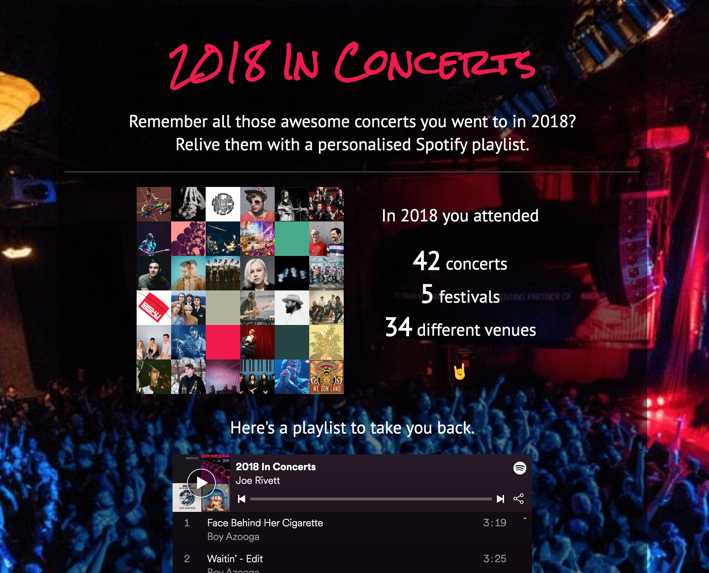

# Year In Concerts

Year In Concerts is a web app which generates a playlist based on the concerts attended in the previous year by a Songkick user.

The app is built in Ruby on Rails with a small amount of test coverage in Rspec.

The app can be found running on Heroku [here](https://songkick-year-in-concerts.herokuapp.com/).

# The process is roughly:

1. Authenticate with Spotify to get an API access token

2. Request the user’s concert attendances for the previous year from the Songkick API

3. Create a playlist on the user’s Spotify account to house the tracks

4. Match the artists seen in attended concerts with artists on Spotify

5. For each artist, fetch the top tracks and add these to the playlist

6. Generate a Year In Concerts summary and link to the generated playlist

# Running the app

- The app runs on Ruby 2.6.5 and uses `bundler` for package management
- You will need to set up a Spotify application, and set `/auth/spotify/callback` as a callback URL
- You will need a Songkick API key
- To run in Terminal:

`SPOTIFY_CLIENT_ID=<spotify_client_id> SPOTIFY_CLIENT_SECRET=<spotify_client_secret> SONGKICK_API_KEY=<songkick_api_key> rails server`

# Limitations

- The app ignores festivals, because the number of headliners introduces a lot of room for error with regards to who the user actually saw perform
- The app does not account for support acts, even if the user tracks these
